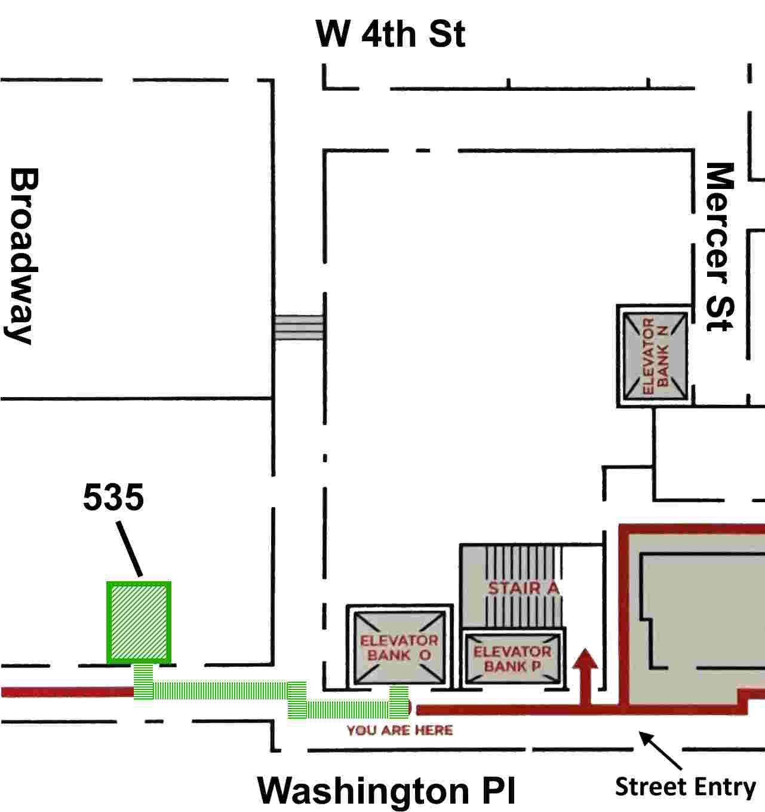

---
# Contact widget.
# Documentation: https://sourcethemes.com/academic/docs/page-builder/
widget: contact

# This file represents a page section.
headless: true

# Order that this section appears on the page.
weight: 130

title: Contact
subtitle: ""

content:
  # Automatically link email and phone or display as text?
  autolink: false
  
  # Email form provider
  #form:
  #  provider: netlify
  #  formspree:
  #    id:
  #  netlify:
      # Enable CAPTCHA challenge to reduce spam?
  #    captcha: true
  
design:
  columns: '2'
---

> **Reconnaissance territoriale**
>
> Je reconnais respectueusement que l'Université du Québec à Rimouski est située sur le Wolastokuk, territoire ancestral non cédé de la Nation Wolastoqey, et plus particulièrement de la Première Nation Wolastoqiyik Wahsipekuk. Je reconnais et respecte les liens continus que les Wolastoqiyik entretiennent avec ce territoire, ses terres et ses eaux. [[Source]][def]

[def]: https://wolastoqiyikwahsipekuk.ca/fr/territoire
